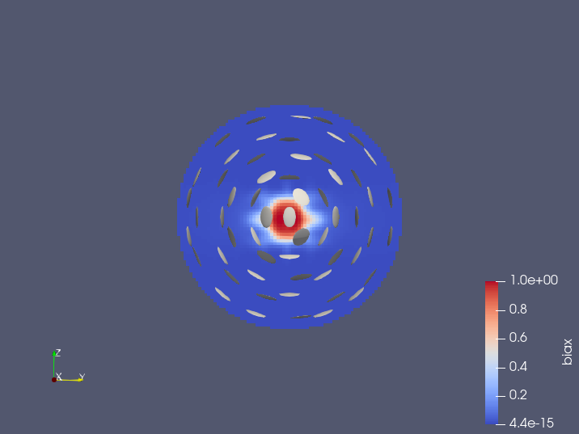
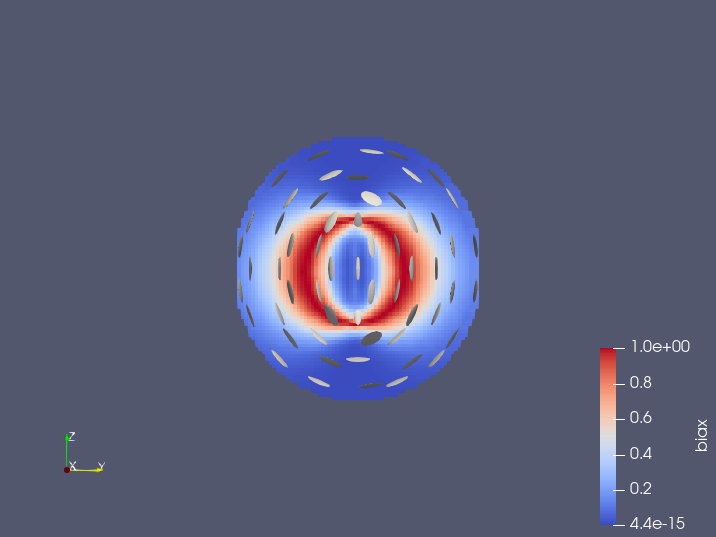
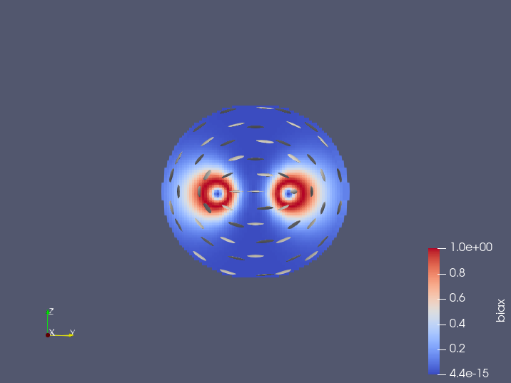
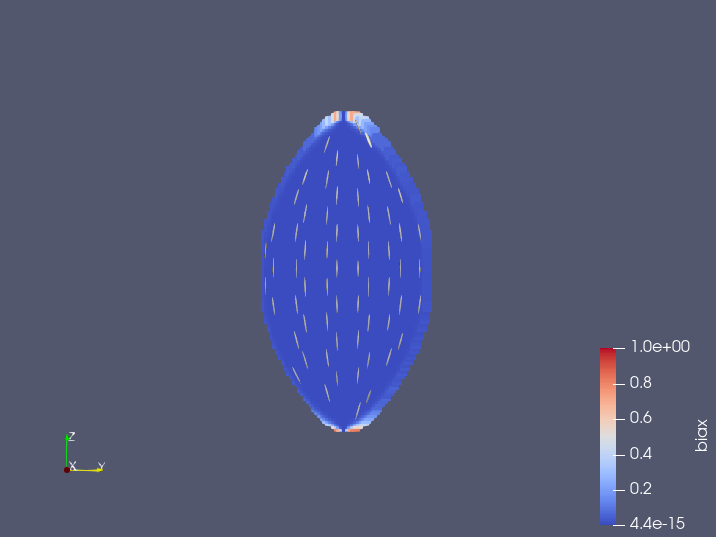

# Diffuse-interface LdG model

This is a **N**ematic **L**iquid **C**rystal model (with **M**odified bulk energy) implemented with **S**pectral method. 

## Program structure

`nlc_state.py` and `nlc_func.py` are infrastructural programs.
`nlc_plot.py` visualizes the NLC state with methods described in [Hu et al. 2016](https://www.cambridge.org/core/product/identifier/S1815240616000153/type/journal_article).
`main.py` displays a typical minimization process that returns a solution, and plots the result (in the exact same way as `nlc_plot.py`).

## Run

`nlc_plot.py` and `nlc_solve.py` both accept command line arguments. One may run them with the `-h` flag to see detailed usage. `nlc_cont.py` performs continuation tests between a pair of config files.

The `ring.json` configuration should return a *radial* state (spherical droplet, layers of biaxial discs surrounding a biaxial core), and the `tactoid.json` configuration should return a *tactoid* (elongated sphere, aligned uniaxial material pointing from one end to the other, almost no biaxiality).

Iteration converging to the tactoid is very slow. For more efficiency one may use the radial state (solved from `radial.json`) as the initial value.

## Output and visualization

Outputs are in the [VTK](https://vtk.org) format, a type of 3D data set that can be opened by [ParaView](https://paraview.org/download/).

To see the interiors of the biaxiality field, you may need to manually adjust the opacity.

## Special solutions

We find $N=47$ sufficient to capture the interface accurately with Fourier wave.

The configuration `ring.json` allows three coexisting states: radial, split-core and ring.
$$A=-1500, B=6400,C=3500, l_0=2\times 10^{-7}, V_0=0.1, \varepsilon=0.005, \omega=20, w_p=1, w_v=0.5$$

- To obtain the radial state, start with a spherical region. Any reasonable step size works.
- To obtain the split-core state, start with a prolate sphere. The test with level sets of
$(x-0.5)^2+(y-0.5)^2+0.8 (z-0.5)^2$
works. One should also choose a smaller step size.
- To obtain the radial state, start with an oblate sphere. The test with level sets of $(x-0.5)^2+(y-0.5)^2+1.1 (z-0.5)^2$ works.

The configuration `tactoid.json` is the same as `ring.json` except that $l_0=2\times 10^{-6}$. It yields the tactoid.
